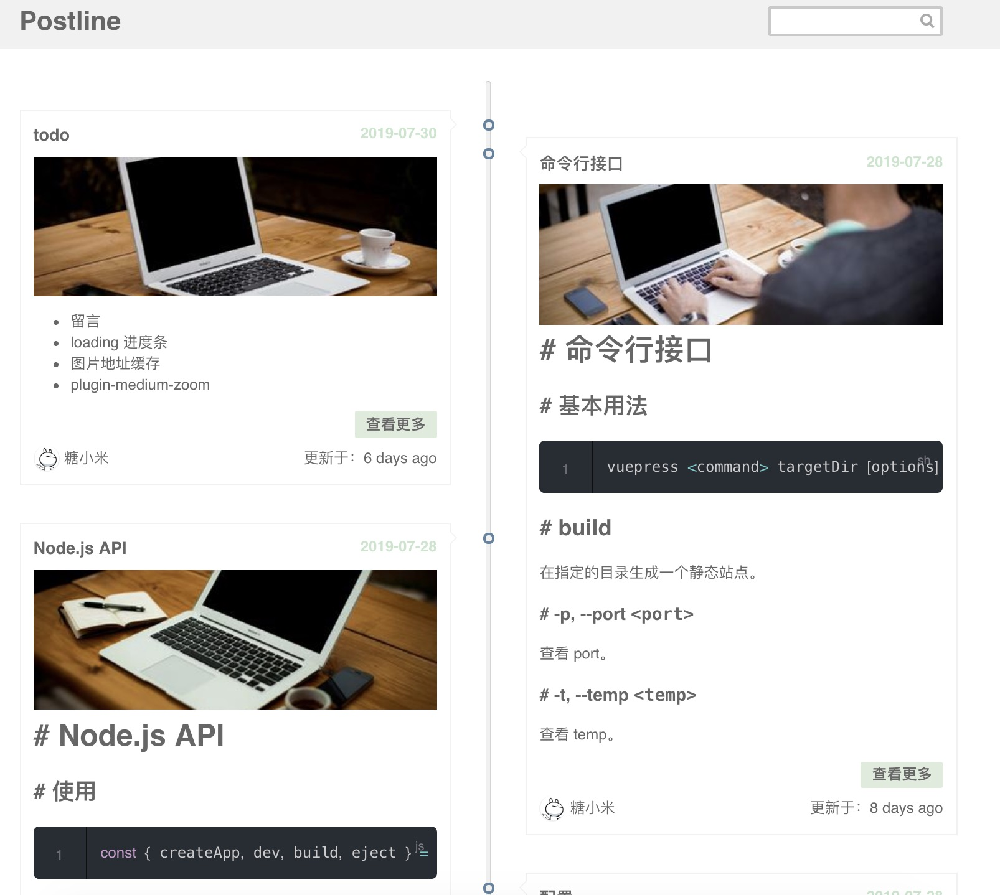

# vuepress-theme-postline

> 1. 这是一个vuepress主题
> 2. 主题非常简洁，根据文章发布的时间进行布局
> 3. 效果：[postline](https://im.github.io/vuepress-theme-postline/) 


## 预览




## 基本配置

```javascript
// config.js
module.exports = {
    themeConfig: {
        authorInfo: {
            headerUrl: 'https://avatars3.githubusercontent.com/u/12029165?s=460&v=4', // 显示的作者头像
            name: '糖小米', // 显示的作者名称
            github: 'https://github.com/im' // 作者github 地址
        },
        topTime: false, // 是否显示文章顶部时间
        lastUpdated: true, // 是否显示最近更新时间
        search: true, // 是否显示搜索
        cover: true, // 是否显示封面 默认随机图片封面
        gitalk: {
            clientID: '', // Github Application clientID  申请地址 https://github.com/settings/developers
            clientSecret: '', // Github Application clientSecret
            repo: 'vuepress-theme-postline', // 存储你评论 issue 的 Github 仓库名
            owner: 'Github 用户名', 
            admin: ['Github 用户名'],
            labels: ['gitalk'], // 文章对应的issue label
            distractionFreeMode: true, // 免打扰模式
            language: 'zh-CN' // 国际化
        }
    }
};
```